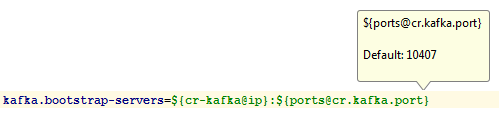
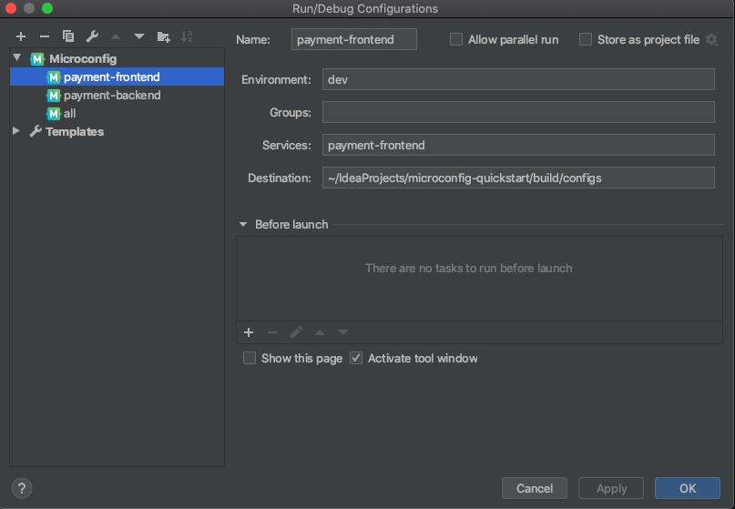
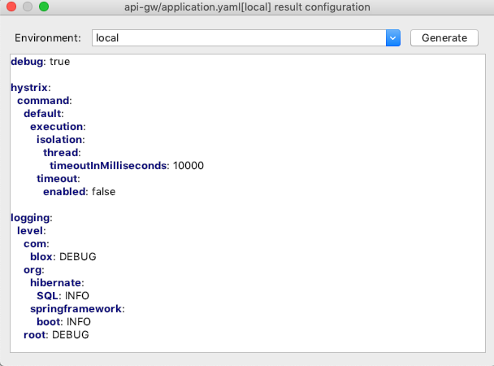

# Microconfig IntelliJ IDEA plugin

IntelliJ IDEA plugin for Microconfig that allows navigating to #include and placeholders' sources, resolving placeholders and other useful stuff.

### Installation
Install plugin by name `Microconfig.io` from Idea `Settings -> Plugins -> Marketplace`

Or download plugin zip file from https://plugins.jetbrains.com/plugin/12064-microconfig-io and import it via   `Settings -> Plugins -> Install plugin from disk...`

### Plugin usage
Plugin adds it's submenu in `Main Menu -> Tools -> Microconfig`. Also the same menu appears in `RightClick` menu.

Microconfig has two actions:
- Jump to component (F10)
- Resolve placeholder (Ctrl-F10 / Command-F10)

#### Jump to component

`Jump to component` supports navigation from `#inlude component` line. Once chosen from the menu or on the hotkey press
it will try to find `component` in 'components' directory and open the corresponding file inside.

Also it can jump to a component referenced in a placeholder like `${component@key}`. To choose a placeholder just place your cursor inside `{}`.
On Jump it will try to find `component` file and then a line with `key` inside it. Once found it will open that file and place cursor on `key` line.

#### Resolve placeholder

`Resolve placeholder` supports two modes. 

If activated with cursor on a property' key it will try to resolve the whole property and show values grouped by env names in a small hint.

If activated with cursor inside placeholder `${}` it will try to resolve only that placeholder.

### Config build
You can create standard IDEA Run configuration for Microconfig to build configs with plugin.

### Configuration preview
You can preview configuration for a component on the fly. To open preview either activate `Microconfig -> Preview component` or use default hotkey (Shift-Ctrl-F10 / Shift-Command-F10). 
Preview window allows you to see resulting configs for different environments and it even matches your current LookAndFeel. 
 

