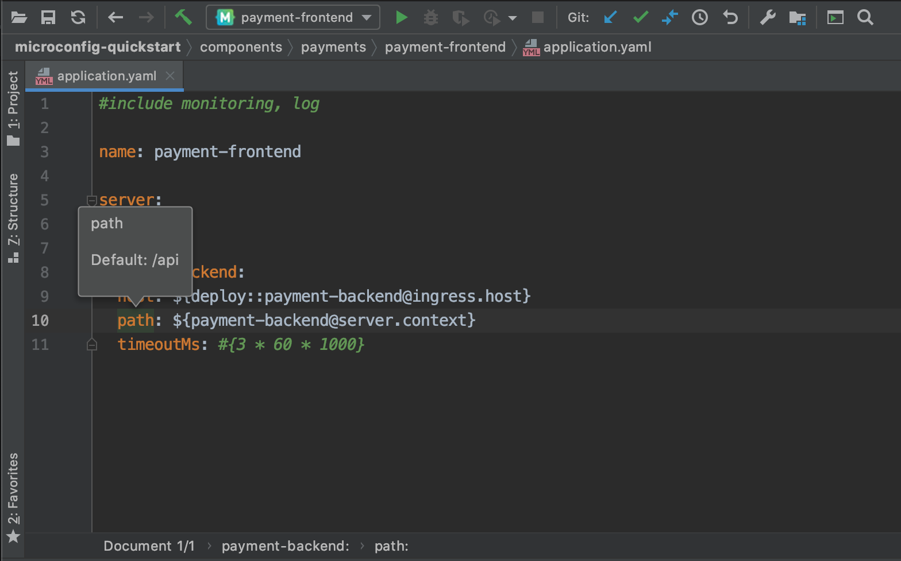
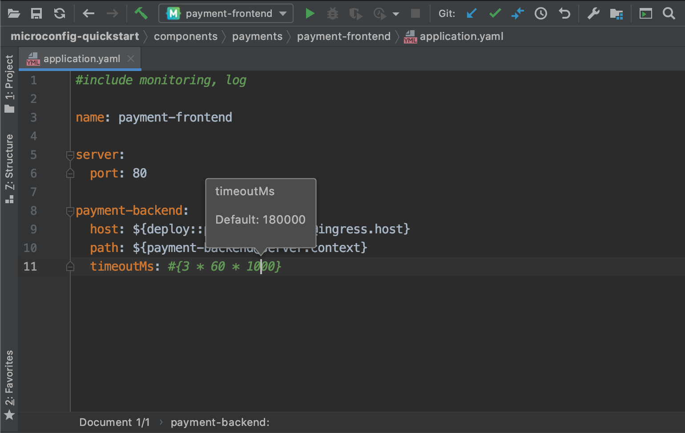
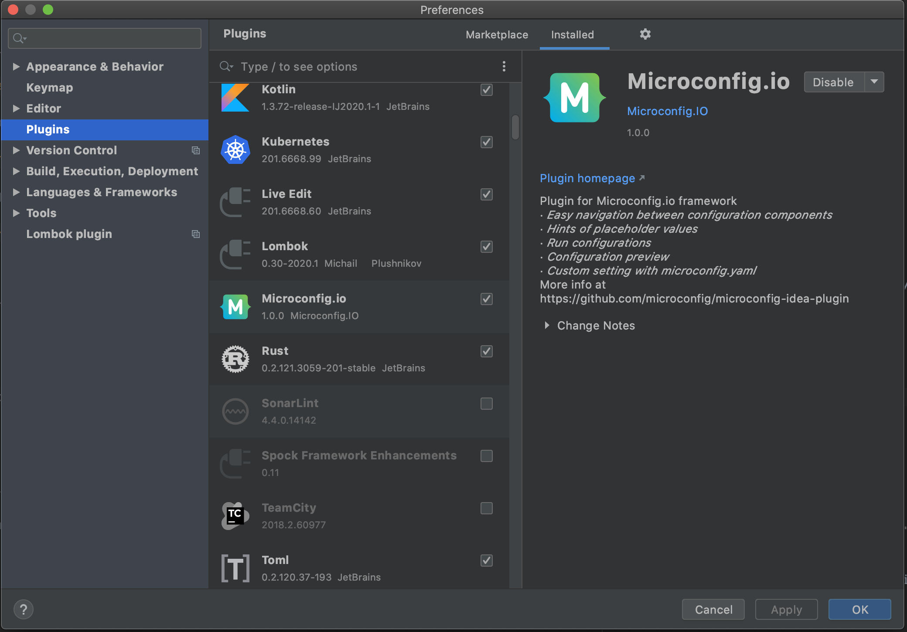

# Microconfig IntelliJ IDEA plugin

IntelliJ IDEA plugin for Microconfig that allows navigation to #include and ${placeholder} sources, preview individual placeholders or whole components and build your configs.

### Plugin usage
Plugin adds a submenu in `Main Menu -> Tools -> Microconfig` and in editor `RightClick` popup.

Microconfig has 3 actions:
- Jump to component (F10)
- Resolve placeholder (Ctrl-F10 / Command-F10)
- Preview component (Shift-Ctrl-F10 / Shift-Command-F10)

#### Jump to component

`Jump to component` supports navigation from `#include component` line. Once activated from the menu or by a hotkey 
it will try to find `component` in 'components' directory and open matching file inside.

Also, it can jump to a component referenced in a placeholder like `${component@key}`. To choose a placeholder just place your cursor inside `{}`.
On Jump it will try to find `component` file and then a line with `key` inside it, once found it will place cursor on that line.

#### Resolve placeholder

`Resolve placeholder` shows value preview grouped by env names in a small hint. 

If activated with cursor inside placeholder `${}` it will try to resolve only selected placeholder.

If activated with cursor on a property key it will try to resolve the whole property.

It also works with expression language.

### Configuration preview
You can preview configuration for a component on the fly. To open preview either activate `Microconfig -> Preview component` or use default hotkey (Shift-Ctrl-F10 / Shift-Command-F10). 
Preview window allows you to see resulting configs for different environments. 
 

### Config build
You can create standard IDEA Run configuration for Microconfig to build configs with your IDE.

### Installation
Install plugin by name `Microconfig.io` from Idea `Settings -> Plugins -> Marketplace`

Or download plugin zip file from https://plugins.jetbrains.com/plugin/12064-microconfig-io and import it via   `Settings -> Plugins -> Install plugin from disk...`

### Compatibility
The plugin is compatible with any JetBrains IDE: IntelliJ IDEA,  PhpStorm,  WebStorm,  PyCharm,  RubyMine,  AppCode,  CLion, GoLand,  DataGrip,  Rider, MPS,  Android Studio
